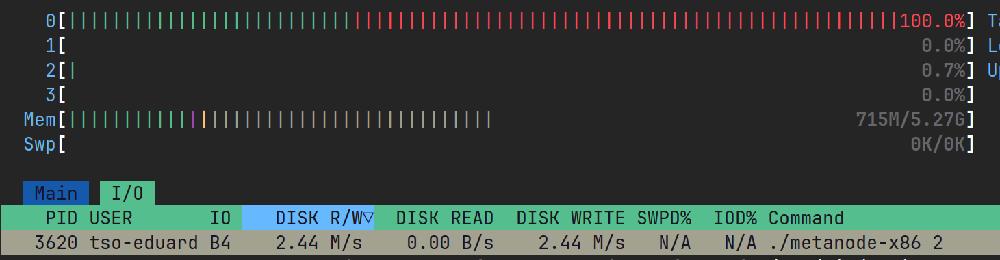
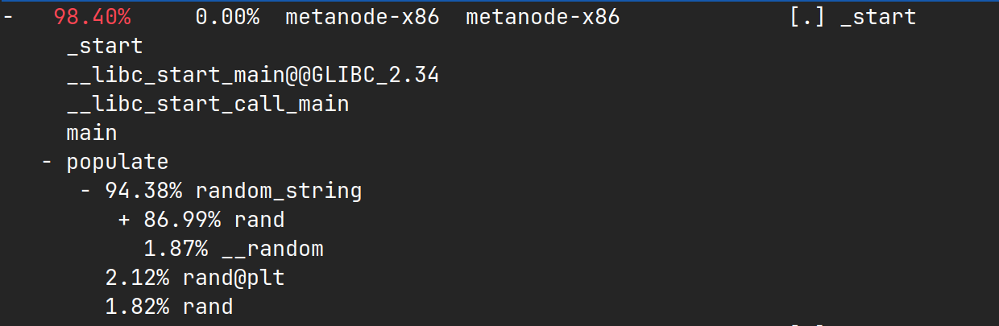
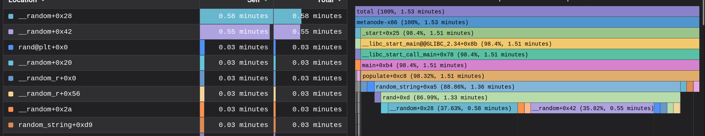
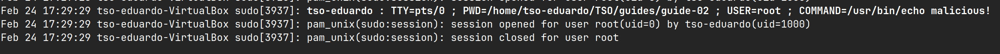

# Guide 02 - Observability

This guide will allow you to try out different tools that allow observing and understanding the behavior of
applications without inspecting their source code.

**Tools/technologies**: We will be using the setup from Guide 0, and the code and binary provided along with this guide (the code is based on the one developed on **Guide 1**). You will be using tools such as `strace`, `perf`, `journalctl`, and `htop`.

**Learning Outcomes**: Explore monitoring, logging, tracing, and profiling tools. Understand the behavior of applications without source code analysis. Explore OS-level observability.


## Warmup

After executing `time ./metanode`, the output of the `metanode` program is:

```
blocking
resuming
key 0.txt, size 0, refs 10000000
key 1.txt, size 1, refs 0
key 2.txt, size 2, refs 0
key 3.txt, size 3, refs 0
key 4.txt, size 4, refs 0
key 5.txt, size 5, refs 0
key 6.txt, size 6, refs 0
key 7.txt, size 7, refs 0
key 8.txt, size 8, refs 0
key 9.txt, size 9, refs 0
```

We can verify the existence of 10 new files, with names such as `0.txt`, `1.txt`, ... Each of the files has a size of 10MB.

The time measurement output is:
```
real    0m2.130s
user    0m1.591s
sys     0m1.343s
```


## Exercises


### Comparing versions 0 and 1

Version 1 does not write the content; the files have size 0.

The files `1.txt`... are opened for reading, and when attempting to write, an error occurs.

Output of running `time ./metanode 1`:
```
real    0m2.474s
user    0m2.399s
sys     0m0.765s
```

After executing version 1 of the program, we observe that the 10 files are created, but they are empty (their size is 0). We also observe a reduction in execution time on the operating system side.

Using the `strace` command, we can identify the cause of the problem:
```
strace -yy ./metanode 1
```

After analyzing the output, we see that the files are being opened, but the write operation is not being performed (returning `-1`).
```
openat(AT_FDCWD<...>, "3.txt", O_RDONLY|O_CREAT|O_TRUNC, 0600) = 3<.../3.txt>
write(3<.../3.txt>, "nyEZFTTPAPGfiKQ3Y8eswj7hB42sjJWw"..., 10485760) = -1 EBADF (Bad file descriptor)
close(3<.../3.txt>) = 0
```

The problem lies in the `openat()` system call, more specifically in the selected flags. The flags passed were **read-only**, create, and truncate. If a file is opened strictly for reading, it is expected that write operations will fail.


### Version 2

Output of version 2 (`time ./metanode 2`):
```
real    0m37.712s
user    0m9.268s
sys     0m29.264s
```

The size of the resulting files is now correct, compared to the previous version. The execution time of this version is significantly slower than the earlier versions. Using the `htop` tool, we can perform a deeper analysis of the program’s execution and observe that `./metanode 2` is performing a high number of write operations:


Using the `strace` tool, we can verify that the program is writing to the files byte by byte, performing a very high number of system calls per second:
```
...
write(3, "S", 1)                        = 1
write(3, "R", 1)                        = 1
write(3, "d", 1)                        = 1
write(3, "O", 1)                        = 1
write(3, "u", 1)                        = 1
write(3, "N", 1)                        = 1
write(3, "G", 1)                        = 1
....
```


### Version 3

Output of version 3 (`time ./metanode 3`):
```id="kq9x1m"
real    2m21.690s
user    2m17.815s
sys     0m4.568s
```

Version 3 of the program is even slower than version 2. However, from `time` we observe that the system time is not high, and most of the time was spent performing computations in user space. This suggests that the issue may not be related to inefficient use of system calls.

By applying the `strace` tool, we verify that system calls are being used correctly. The `htop` tool shows high CPU usage, but write operations are not excessive.

Using the `perf` command, we can analyze the functions being executed and observe that most of the execution time is "spent" in the `random_string()` function, more specifically in the random number generation function `rand()`:


We can also perform a graphical analysis:



### Version 4

> ⚠️ **Recommendation**: run `sudo -k` to “clear” cached root privileges.

Output of version 4 (`time ./metanode 4`):
```
real    0m3.676s
user    0m1.599s
sys     0m1.412s
```

The file size is correct (10 MB), and the execution time does not show anomalies. In some cases, we can observe that the program prompts for a password during execution, as if it were performing a privileged operation internally.

Using the `journalctl` tool, we verify that there is a login session initiated internally by the `metanode 4` program, which executes a “malicious” command:


We can analyze system calls and search for program executions using `strace`:
```
strace -f -e trace=execve ./metanode 4
```
* The `-f` option allows tracing child processes (`fork()`).

We find the system call we were looking for, executed by a child process:
```
...
[pid  4677] execve("/usr/bin/sudo", ["sudo", "echo", "malicious!"], 0x5a1cb316c968 /* 24 vars */) = 0
...
```

This version of `metanode` demonstrates a security risk in programs. In this case, we were able to identify the issue through `journalctl` because it involved access via `sudo`. If `sudo` is not used, the tool does not report the session initiation.
